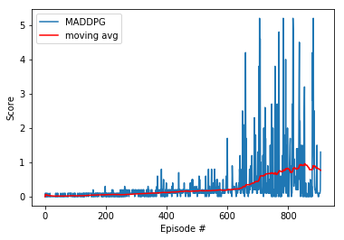

# **REPORT**

# Project III : Collaboration & Competition

## Project Description

### Environment

In this environment called Tennis, two agents control rackets to bounce a ball over a net. If an agent hits the ball over the net, it receives a reward of +0.1. If an agent lets a ball hit the ground or hits the ball out of bounds, it receives a reward of -0.01. Thus, the goal of each agent is to keep the ball in play.

The observation space of an agent consists of 8 variables. Each action is a 2D vector with entries corresponding to movement toward (or away from) the net, and jumping.

- **State space** is a `2x24` dimensional continuous tensor, consisting of positions, and velocities of each agent across 3 frames.

- **Action space** is `2x2` dimentional continuous tensor, corresponding actions for each agent. Every entry in the action tensor should be a number between -1 and 1.

## Approach

To train the Tennis agents I used MDDGP algorithm implementing centralized training and decentralized execution. Each agent receives its own, local observation. Thus it will be possible to simultaneously train both agents through self-play. During training, the critic for each agent uses extra information like states observed and actions
taken by all other agents. For the actor, there is one for each agent. Each actor has access to only its agents observations and actions. During execution time only actors are present and all observations and actions are used.

MADDPG (Multi-agent DDPG) class uses 2 DDPG agents similar to what was used in Udacity classroom for previous projects. Also ReplayBuffer is used as a shared buffer between agents. MADDPG combines states, actions, rewards, next_states, dones from both agents and adds them to shared ReplayBuffer. MADDPG act calls act for 2 DDPG agents.

Before building agents that learn, I started by testing ones that select actions (uniformly) at random at each time step.

Running the random agents a few times resulted in scores from 0 to 0.02. Obviously, if these agents need to achieve an average score of 0.5 over 100 consecutive episodes, then choosing actions at random won't work. However, when you watch the agents acting randomly, it becomes clear that these types of sporadic actions can be useful early in the training process. That is, they can help the agents explore the action space to find some signal of good vs. bad actions. This insight will come into play later when we implement the Ornstein-Uhlenbeck process and epsilon noise decay.

##### &nbsp;

#### Multi-Agent Deep Deterministic Policy Gradient (MADDPG)

MADDPG (Multi-agent DDPG) class uses 2 DDPG agents similar to what was used in Udacity classroom for previous projects. Also ReplayBuffer is used as a shared buffer between agents. MADDPG combines states, actions, rewards, next_states, dones from both agents and adds them to shared ReplayBuffer. MADDPG act calls act for 2 DDPG agents. As an off-policy algorithm MADDPG utilizes four neural networks: a local actor, a target actor, a local critic and a target critic Each training step the experience (state, action, action_other_agent, reward, next state, next_state_other_agent) the two agents gained was stored. Then every training step the agent learned from a random sample from the stored experience. 

The actor tries to estimate the optimal policy by using the estimated state-action values from the critic while critic tries to estimate the optimal q-value function and learns by using a normal q-learning approach. Using this approach one gains the benefits of value based and policy based methods at the same time. By giving the critic access to the action of the other player the learning process gets stabilized without requiring to give the additional information to the actor which is the only network required for acting after the agent was trained successfully.

### The Actor-Network is shown below

      self.actor_local = Actor(state_size, action_size, random_seed).to(device)
      self.actor_target = Actor(state_size, action_size, random_seed).to(device)
      self.actor_optimizer = optim.Adam(self.actor_local.parameters(), lr=LR_ACTOR)
    
### The Critic-Network is shown below

      self.critic_local = Critic(state_size, action_size, random_seed).to(device)
      self.critic_target = Critic(state_size, action_size, random_seed).to(device)
      self.critic_optimizer = optim.Adam(self.critic_local.parameters(), lr=LR_CRITIC, weight_decay=WEIGHT_DECAY)

#### Gradient Clipping

Gradient clipping is a technique that tackles exploding gradients. The idea of gradient clipping is very simple: If the gradient gets too large, we rescale it to keep it small.
Initially, I added batch normalization between every layer in both the actor and critic models. However, this may have been overkill, and seemed to prolong training time. I eventually reduced the use of batch normalization to just the outputs of the first fully-connected layers of both the actor and critic models.

Gradient clipping ensures the gradient vector g has norm at most c. This helps gradient descent to have a reasonable behaviour even if the loss landscape of the model is irregular. The following figure shows an example with an extremely steep cliff in the loss landscape. Without clipping, the parameters take a huge descent step and leave the “good” region. With clipping, the descent step size is restricted and the parameters stay in the “good” region.

Note that this function is applied after the backward pass, but before the optimization step.

      # Compute critic loss
      
        Q_expected = self.critic_local(states, actions)
        critic_loss = F.mse_loss(Q_expected, Q_targets)
        
      # Minimize the loss
      
        self.critic_optimizer.zero_grad()
        critic_loss.backward()
        torch.nn.utils.clip_grad_norm_(self.critic_local.parameters(), 1)
        self.critic_optimizer.step()

##### &nbsp;

## Results

The performance goal is an average reward of at least +0.5 over 100 episodes, taking the best score from either agent for a given episode.

The best-performing agents were able to solve the environment in 607 episodes, with a top score of 5.2 and a top moving average of 0.927.

## Further Improvements
The following techniques can be tried out to further improve the performance of the network
- [Prioritized Experience Replay](https://arxiv.org/abs/1511.05952): This technique prioritizes the experiences and chooses the best experience for further training when sampling from the buffer. This is known to reduce the training time and make the training more efficient.
- [Asynchornous Actor Critic Agent](https://medium.com/emergent-future/simple-reinforcement-learning-with-tensorflow-part-8-asynchronous-actor-critic-agents-a3c-c88f72a5e9f2): This technique trains multiple worker agents that interact with a glocal network asynchronously to optimize the policy and value function. This way, each of these agents interacts with it’s own copy of the environment at the same time as the other agents are interacting with their environments.
- [Proximal Policy Optimization](https://arxiv.org/abs/1707.06347): This technique modifies the parameters of the network in such a way that the new set of parameters is looked for in the immediate neighbourhood of the parameters in the previous iteration of the training. This is shown also to be an efficient way of training the network so the search space is more optimal. 
